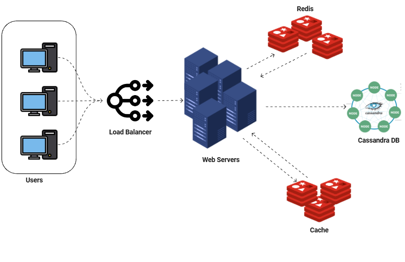

#  URL Shortener 


API de encurtamento de URLs projetada com foco em alta taxa de leitura, baixa latência e arquitetura limpa, utilizando Node.js, TypeScript, Redis, Docker e Cassandra.
O projeto aplica princípios de Clean Architecture, separação de responsabilidades e conceitos de System Design voltados a sistemas distribuídos.

---

##  Tecnologias Utilizadas

* **Node.js** + **TypeScript**: API performática e tipada
* **Express**: camada HTTP simples e desacoplad
* **Cassandra**:  banco distribuído otimizado para leitura e alta disponibilidade
* **Redis**: cache de leitura, cache negativo e contador distribuído
* **Docker**: containerização e fácil deploy
* **Joi**: validação de dados
* **Pino**: logging estruturado e performático
* **Helmet** e **Cors**: segurança e controle de acesso
* **Hashids**: geração de shortcodes curtos e compatíveis com URL
* **Jest**: testes automatizados

---

##  Requisitos Funcionais

1. **Encurtamento de URL** — Dado um URL longo, retornar um URL encurtado.
2. **Redirecionamento da URL** — Dado um URL curto, redirecionar para o URL original.

---

## Requisitos Não Funcionais

1. O sistema deve suportar **100 milhões de URLs geradas por dia**.
2. A URL encurtada deve ser **o mais curta possível**.
3. Somente **números (0-9)** e **caracteres (a-z, A-Z)** são permitidos.
4. Para cada 1 operação de gravação, devem ocorrer **10 operações de leitura**.
5. O comprimento médio das URLs armazenadas é de **100 bytes**.
6. URLs devem ser armazenadas por **no mínimo 10 anos**.
7. O sistema deve operar em **alta disponibilidade (24/7)**.

---
##  System Design



---

## Objetivo do Projeto
Este projeto foi desenvolvido com foco educacional e arquitetural, simulando requisitos de escala real como:
* alto volume de requisições
* predominância de leitura sobre escrita
* persistência de longo prazo
* cache agressivo
* tolerância a falhas

## Modelagem do Cassandra

A modelagem segue o princípio de que o `shortcode` é único e deve ser a **chave primária**, garantindo eficiência nas buscas:

```sql
CREATE TABLE url (
  shortcode TEXT PRIMARY KEY,
  long_url TEXT,
  created_at TIMESTAMP
);
```

A geração do `shortcode` usa **Base62** combinada com **Hashids** para garantir unicidade e ofuscação.

---

## Segurança

* **Helmet**: protege a aplicação com cabeçalhos HTTP.
* **Cors**: controle de origem cruzada.
* **Rate limit** para proteção contra abuso.
* **Hashids**: impede previsibilidade dos códigos gerados.


---

## Escalabilidade
Este projeto simula decisões comuns em sistemas de grande escala, como:
* Separação entre leitura e escrita
* Uso agressivo de cache
* Banco distribuído orientado a leitura
* API stateless, pronta para replicação horizontal

---

## Observabilidade
* Logs estruturados com Pino
* Log HTTP automático
* Erros centralizados via middleware

---

## Endpoints

* Encurtar URL

```
http

POST /api/shorten
```


```
body json

{
  "long_url": "https://example.com"
}
```


```
response
{
  "shortcode": "Ab3X9",
  "short_url": "http://localhost:3000/Ab3X9"
}
```

* Redirecionar - redireciona para a URL original

```
http

GET /:shortcode
```

* Health Check
```
http
GET /health
```


##  Execução do Projeto

### Pré-requisitos
Antes de executar a aplicação, certifique-se de ter os seguintes itens instalados na sua máquina:
* Node.js (versão LTS recomendada)
* Docker
* Docker Compose
* Git

### Passo a passo

* Clone o repositório

```
git clone https://github.com/anamartinsr/url_shortener.git
```

* Acesse a pasta do projeto
```
cd url_shortener
```
* Configure as variáveis de ambiente
* Crie um arquivo .env na raiz do projeto com as variáveis necessárias (exemplo disponível em .env.example).
* Suba a aplicação com Docker
```
docker-compose up --build
```
### Acesso à aplicação
Após a inicialização, a API estará disponível em:
```
http://localhost:3000
```

---

## Testes

Execute os testes com:

```bash
npm run test
```

Os testes são implementados com **Jest** e **Supertest**.

---

## Contribuições
Contribuições são bem-vindas.
Sinta-se à vontade para abrir issues, enviar pull requests ou sugerir melhorias arquiteturais.

### Se for contribuir:
* mantenha a separação de camadas proposta pela arquitetura
* evite acoplamento entre domínio e infraestrutura
* priorize legibilidade, simplicidade e decisões bem justificadas

## Forks e Uso do Projeto
Você pode forkar, estudar, adaptar e evoluir este projeto livremente.
O objetivo principal é servir como referência prática de arquitetura, system design e boas práticas em APIs backend.


